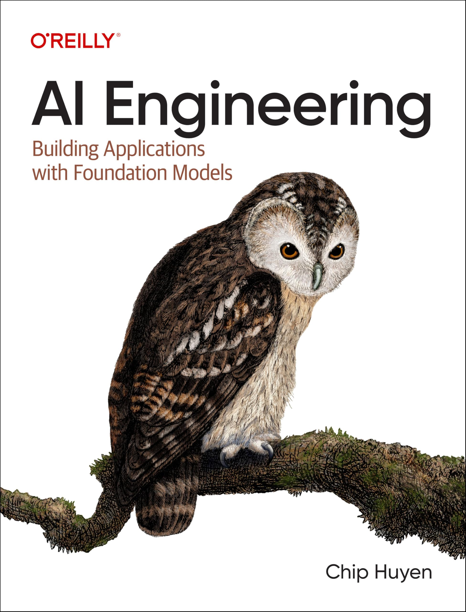

# AI Engineering — 10-Lesson Course



Bilingual (English / 中文) course on building applications with foundation models, based on
Chip Huyen's *AI Engineering: Building Applications with Foundation Models* (O'Reilly, 2025).

10 lessons, 2 hours each (1 hour concept + 1 hour hands-on).

## Two tracks

| Track | Material | Who it's for |
|-------|----------|--------------|
| **Concept** | [`AI_Engineering_10_Lesson_Course_EN.md`](AI_Engineering_10_Lesson_Course_EN.md) / [`AI工程化十节课教程_中文版.md`](AI工程化十节课教程_中文版.md) | anyone, no coding — web tools only (ChatGPT / Poe / AI Studio) |
| **Code** | the `.ipynb` notebooks | some technical comfort required — see below |

The tracks complement each other; neither is a translation of the other. Concept track builds
intuition, code track makes the same ideas reproducible and editable.

### How much programming do you need?

**Concept track: none.** Everything runs in a browser with free tools.

**Code track: you don't have to *write* Python, but you can't avoid *touching* it.** To get
through the notebooks you need to be comfortable with:

- running commands in a terminal (the Quick start block below)
- getting an API key from a provider dashboard, or installing Ollama
- opening Jupyter and running cells in order
- editing values inside a Python dict — e.g. changing `PROVIDER`, or filling in your own scores
  in Lesson 4
- reading an error message and matching it against the Troubleshooting table

No lesson asks you to write a function from scratch, and no prior Python is assumed. But "no
programming background at all" is optimistic for this track — a complete beginner should either
pair with someone technical for setup, or do the concept track first and come back.

If the terminal is the blocker, an instructor can set the environment up once and hand out a
ready-to-run machine or a hosted notebook. From there the course is mostly *run the cell, read
the output, change one value, run it again*.

## Quick start

```bash
# 1. Environment (already created in .venv/ — recreate with these two lines if needed)
uv venv .venv --python 3.13
uv pip install --python .venv/bin/python -r requirements.txt

# 2. Register the Jupyter kernel
.venv/bin/python -m ipykernel install --user --name aie --display-name "AIE Course (.venv)"

# 3. Add your key
cat > .env <<'KEY'
OPENAI_API_KEY=sk-your-key-here
KEY

# 4. Launch
source .venv/bin/activate
jupyter lab
```

In VS Code or an existing Jupyter, just pick the kernel **AIE Course (.venv)**.

Start with [`00_Environment_Setup.ipynb`](00_Environment_Setup.ipynb) — it tests connectivity to
every provider and tells you which ones your keys can reach.

## Choosing a provider

Every lesson notebook opens with the same config cell. Change **one line** to switch:

```python
PROVIDER = 'openai'   # 'openai' / 'deepseek' / 'openrouter' / 'ollama'
```

| PROVIDER | Key in `.env` | Small / big model | Embeddings (Lesson 6) |
|----------|---------------|-------------------|-----------------------|
| `openai` | `OPENAI_API_KEY` | `gpt-5.6-luna` / `gpt-5.6-terra` | ✅ `text-embedding-3-small` |
| `deepseek` | `DEEPSEEK_API_KEY` | `deepseek-v4-flash` / `deepseek-v4-pro` | ❌ falls back to a local bag-of-words vector |
| `openrouter` | `OPENROUTER_API_KEY` | `openai/gpt-5.6-luna` / `openai/gpt-5.6-terra` | ❌ same fallback |
| `ollama` | none (local, free) | `gemma4:e2b-mlx` — or any model you pull | ✅ `nomic-embed-text` (pull it first) |

All four speak the OpenAI API format, so no other code changes. The rest of each notebook only
uses `MODEL`, `MODEL_BIG`, and `EMBEDDING_MODEL`.

Running all ten notebooks costs roughly **$0.10** on OpenAI pricing. DeepSeek is cheaper;
Ollama is free.

### Running fully offline with Ollama

```bash
ollama serve
ollama pull gemma4:e2b-mlx      # ~6.5GB, MLX build for Apple Silicon
ollama pull nomic-embed-text    # ~275MB, only needed for Lesson 6
```

Then set `PROVIDER = 'ollama'`.

**`gemma4:e2b-mlx` is only the proof of concept — use any local model your machine can handle.**
It is a small 2B model chosen to show that the notebooks run end-to-end with zero API spend. It
does run every cell, but answer quality is well below the cloud models, and it shows most in the
evaluation and judging lessons. A bigger local model makes those lessons noticeably better.

To swap it, pull whatever you like from [ollama.com/library](https://ollama.com/library) and put
that name in the `ollama` block of the config cell:

```python
'ollama': {
    'model': 'your-model-here',        # e.g. a 7B/8B chat model
    'model_big': 'your-bigger-model',  # can be the same name if you only have one
    ...
}
```

Rough sizing — a 4-bit quantized model needs about **1GB of RAM/VRAM per billion parameters**,
plus a couple of GB of headroom:

| Your machine | Practical model size |
|--------------|----------------------|
| 8GB RAM | 2–3B |
| 16GB RAM | 7–8B |
| 32GB RAM | 13–14B, or a small MoE |
| 64GB+ RAM / dedicated GPU | 30B+ — closest to cloud quality |

Setting `model` and `model_big` to two *different* local models also makes Lesson 4 (model
comparison) and Lesson 9 (small vs. big latency) meaningful again; with one model both sides of
those comparisons are identical.

On Apple Silicon, `-mlx` builds run through Apple's MLX framework and are faster than the generic
GGUF builds. On other hardware just drop the suffix.

## Lessons

| # | English notebook | 中文 notebook |
|---|------------------|---------------|
| 1 | [Introduction to AI Engineering](EN_Lesson_01_Introduction_to_AI_Engineering.ipynb) | [走进AI工程化](Lesson_01_走进AI工程化.ipynb) |
| 2 | [Understanding Foundation Models](EN_Lesson_02_Understanding_Foundation_Models.ipynb) | [揭开基础模型的面纱](Lesson_02_揭开基础模型的面纱.ipynb) |
| 3 | [AI Evaluation Fundamentals](EN_Lesson_03_AI_Evaluation_Fundamentals.ipynb) | [AI评估入门](Lesson_03_AI评估入门.ipynb) |
| 4 | [AI System Evaluation in Practice](EN_Lesson_04_AI_System_Evaluation_in_Practice.ipynb) | [AI系统评估实践](Lesson_04_AI系统评估实践.ipynb) |
| 5 | [Prompt Engineering](EN_Lesson_05_Prompt_Engineering.ipynb) | [提示工程](Lesson_05_提示工程.ipynb) |
| 6 | [RAG and AI Agents](EN_Lesson_06_RAG_and_AI_Agents.ipynb) | [RAG与AI智能体](Lesson_06_RAG与AI智能体.ipynb) |
| 7 | [Model Fine-Tuning](EN_Lesson_07_Model_Fine_Tuning.ipynb) | [模型微调](Lesson_07_模型微调.ipynb) |
| 8 | [Data Is King](EN_Lesson_08_Data_is_King.ipynb) | [数据为王](Lesson_08_数据为王.ipynb) |
| 9 | [Inference Optimization](EN_Lesson_09_Inference_Optimization.ipynb) | [推理优化](Lesson_09_推理优化.ipynb) |
| 10 | [AI Architecture and Continuous Evolution](EN_Lesson_10_AI_Architecture_and_Continuous_Evolution.ipynb) | [AI架构与持续进化](Lesson_10_AI架构与持续进化.ipynb) |

## Repo layout

```
00_Environment_Setup.ipynb              provider connectivity check — run this first
EN_Lesson_XX_*.ipynb                    code track, English
Lesson_XX_*.ipynb                       code track, 中文
AI_Engineering_10_Lesson_Course_EN.md   concept track, English
AI工程化十节课教程_中文版.md               concept track, 中文
assets/                                 images used by this README
requirements.txt                        shared dependencies
.env                                    your API keys (git-ignored, never commit)
```

## Troubleshooting

| Symptom | Fix |
|---------|-----|
| `no API key found for <provider>` | `.env` missing, or the key name doesn't match the table above |
| Lesson 6 prints a bag-of-words warning | provider has no embeddings endpoint — switch to `openai`, or `ollama` + `nomic-embed-text` |
| `model "..." not found, try pulling it first` | `ollama pull <model>` |
| Kernel has no `openai` module | wrong kernel selected — pick **AIE Course (.venv)** |

## Notes for instructors

- Keys live in `.env` only; `.gitignore` already excludes it. Never commit a key.
- Model IDs and prices drift. Verify against the provider's pricing page before teaching
  Lesson 9, which quotes per-million-token rates.
